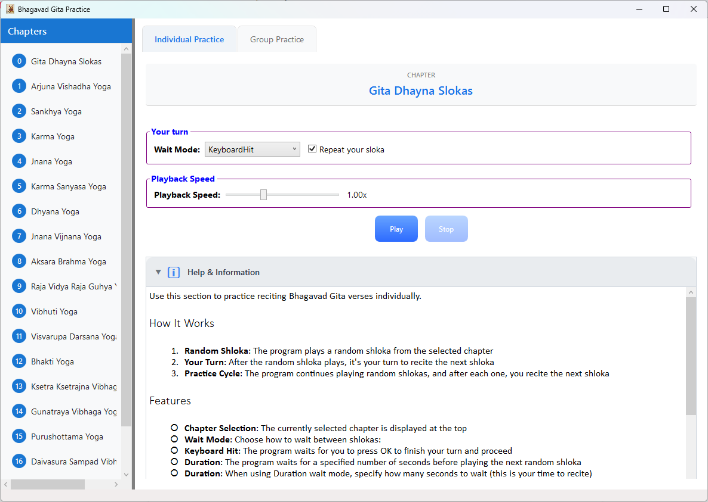
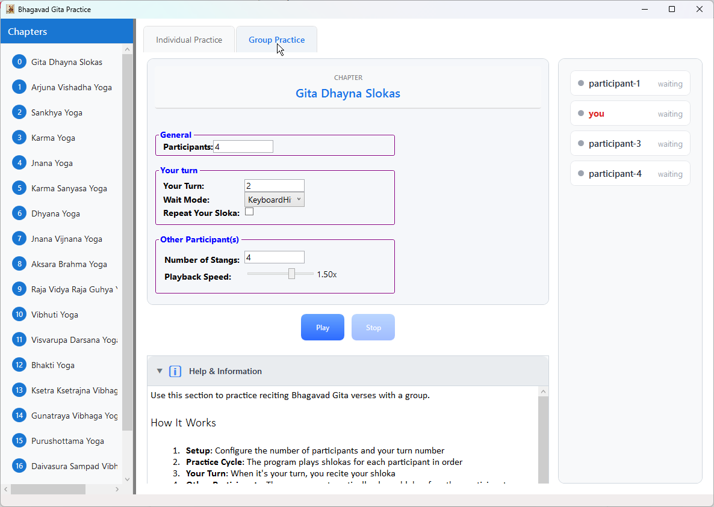

# Gita Practice

Gita Practice is a focused application for strengthening Bhagavad Gita recitation through structured audio practice. It offers two practice modes with flexible pacing, letting you recite at your own rhythm while the program guides the flow.

## Overview

Choose a chapter, set your pace, and press **Play**. The app plays shlokas and gives you time to recite, either by waiting for your confirmation or by timing each turn automatically.

## Practice Modes

### Individual Practice

- The app plays a random shloka from the selected chapter.
- It becomes your turn to recite the next shloka.
- The cycle continues with more random shlokas and your recitation after each one.

### Group Practice

- Configure the total number of participants.
- Select your turn number.
- The app plays shlokas for each participant in sequence.
- When it is your turn, you recite your shloka, then the session continues.

## Features

- **Chapter Selection**: Displays the currently selected chapter.
- **Wait Mode**:
  - **Keyboard Hit**: You proceed when you press OK after reciting.
  - **Duration**: The app waits for a set number of seconds.
- **Duration**: Sets your recitation time in Duration mode.
- **Repeat Your Shloka**: Optionally replay your shloka after you recite.
- **Playback Speed**: Adjust from 0.5x to 2.0x.
- **Number of Stanzas** (Group Practice): Set how many stanzas other participants will recite.

## Controls

- **Play**: Start the practice session.
- **Stop**: Stop the session at any time.

## Typical Flow

1. Select your settings (chapter, wait mode, duration, playback speed, and other options).
2. Click **Play** to begin.
3. Recite when it is your turn based on the selected mode.
4. Continue until you stop the session.
